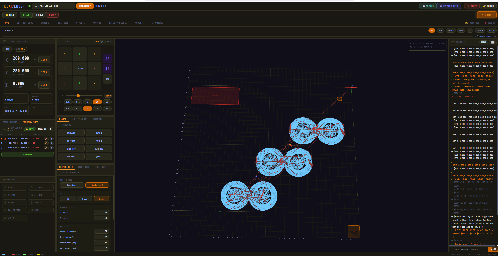

# FlexiSender

A browser-based GrblHAL sender with a live 3D toolpath visualizer, built as a single self-contained HTML file. No installation, no server, no dependencies — open it and connect.

Based on the original flexisender from [Expatria](https://github.com/Expatria-Technologies)

[FlexiSender](https://expatria-technologies.github.io/FlexiSender/flexisender.html)



---

## Connection

FlexiSender supports two methods of connecting to your GrblHAL controller:

**WebSocket** — connects over your local network (WiFi or Ethernet) using `ws://host:port`. Enter the address in the toolbar and click CONNECT. This is the default mode and works in any modern browser.

**USB / Serial** — connects directly via a USB cable using the Web Serial API. This mode is only available in Chrome and Edge. Select USB/Serial in the Options tab, configure baud rate and serial parameters, then click CONNECT — the browser will open its port picker. The browser remembers your last port.

On connect, FlexiSender auto-detects controller capabilities via `$I+` — axis count, RX buffer size, and available features. It parses `[OPT:]` to configure the streaming engine for your specific firmware build.

### Streaming Engine

FlexiSender uses IOSender-compatible character-counting (aggressive) buffering. Rather than waiting for one `ok` before sending the next line, it tracks the exact byte occupancy of the controller's RX buffer and keeps it saturated at all times. This eliminates planner starvation on fast or short-move programs.

- Byte-accurate RX buffer tracking using a FIFO send queue
- Auto-detects buffer size from `[OPT:]` — works with 128B, 256B, or larger buffers
- Real-time commands (`?`, `!`, `~`, `\x18`) bypass the buffer and are never counted
- Stream halts on error with the offending line clearly identified in the console

---

## 3D Toolpath Visualizer

The RUN tab features a full 3D viewport powered by Three.js that displays your loaded G-code as a toolpath:

- Cut moves (G1) are shown in cyan, rapids (G0) in red, and the executed path in green
- An animated tool marker tracks the live machine position from status reports
- Orbit (left-drag), pan (right-drag), zoom (scroll) — touch gestures are also supported
- Preset views: ISO, TOP, FRONT, SIDE, plus FIT to auto-frame the loaded file
- The toolhead marker can be toggled on/off, and WCS origin markers can be shown in the viewport
- Toolpath is parsed entirely in the browser — no server-side processing
- Rulers along the X and Y edges show coordinates in either machine or work (WCS) space, configurable in Options
- Perspective and orthographic projection modes are available
- Viewport extents (grid bounds) are configurable in Options to match your machine's working area

A progress bar above the viewport shows job progress during streaming, with a line counter.

---

## Modules

Modules are floating panels that appear on the RUN tab. They can be dragged to any position, resized, docked into a tiled layout, and individually enabled or disabled.

To manage modules, go to the **MODULES** tab. Modules are organized into groups — you can enable an entire group or toggle individual modules. Each module card has a size selector (normal / large / xl / xxl). Enabled modules appear as draggable panels overlaying the 3D viewport on the RUN tab.

Module positions and enabled states are saved to localStorage and restored on reload. The lock button in the tab bar prevents accidental dragging. The dock toggle enables an ImGui-style docking system where modules can be snapped into a tiled layout around the viewport.

### Basic Functions

**Machine Position** — DRO (digital readout) showing axis positions for all detected axes. Displays the active WCS (G54–G59.3), machine state badge (Idle, Run, Hold, Alarm, etc.), and live feed rate / spindle speed. Includes buttons to zero individual axes or all axes, and a WCS selector dropdown.

**Jogging** — XY arrow pad and Z up/down buttons for manual movement. Supports click-to-step mode (sends a single `$J=G91` jog command) and hold-to-jog mode (continuous jog, cancelled on release). Five configurable step sizes for XY and Z independently, plus an adjustable feed rate slider. Diagonal jog is supported (X+Y combinations). Keyboard jogging is also available: arrow keys for XY, PageUp/PageDown for Z. The jog module shows a 3D preview — in click mode a ghost toolhead at the target position, in hold mode a directional arrow.

**Overrides** — Real-time feed rate, rapid, and spindle speed override sliders. Feed and spindle overrides send sequences of ±10/±1 realtime bytes to reach the target value. Rapid snaps to 100%, 50%, or 25%. A reset button restores all overrides to 100%.

**Spindle / Coolant** — Spindle direction control (CW / CCW / OFF) with RPM input, plus flood and mist coolant toggles. Sends M3/M4/M5 for spindle and M7/M8/M9 for coolant.

**Program Limits** — Shows the min, max, and span of X, Y, and Z in the loaded G-code file. Includes a configurable Safe Z height and a FRAME PROGRAM button that sends G0 rapids to trace the XY bounding box of the program at the safe Z height — useful for verifying the program fits your stock.

**Macros** — Quick-access buttons for common G-code commands and machine routines.

### Debug

**Console** — Live timestamped TX/RX log of all communication with the controller. Includes a command input with history (↑/↓ arrows), readline-style shortcuts, and autocomplete for GrblHAL setting names when typing `$`. A touch keyboard overlay is available for tablet use. The number of visible output lines is configurable (50 / 100 / 200 / 500).

**Signals** — Live indicator lights for limit switches (X/Y/Z/A/B), probe, toolsetter, door, and E-Stop inputs. Updates in real-time from the `Pn:` field in status reports.

### Tool and Coordinate Control

**Tool Table** — Live tool library loaded via `$TTLIST`. Shows pocket number, tool number, name, X/Y/Z offsets, diameter, and status (active / in carousel / hand tool). Requires the Expatria ATC Plugin.

**Tool Length** — Probe tool length using a touch plate or fixed toolsetter (G59.3). Applies the offset with G43.1. Supports a reference tool workflow for multi-tool setups.

### Probing

**Tool Length** — Also available as a probing module (same functionality as above).

**Edge Finder** — Find edges and corners of a workpiece. Supports external and internal modes for all four corners and all four edges, plus Z surface probing.

**Center Finder** — Find the center of a bore or boss in X, Y, or both axes. Supports multiple passes for improved accuracy.

**Rotation** — Measure workpiece rotation angle by probing two points along an edge. Optionally applies the measured rotation to the loaded G-code.

All probing modules include a 3D preview overlay in the viewport that animates the probe sequence step-by-step before execution.

### Exclusion Zones

**Exclusion Zones** — Zone management for the EZ (Exclusion Zones) GrblHAL plugin (also compatible with the Sienci ATCI plugin). Shows zones in a compact table with status badge and quick edit/delete. Each zone defines an X/Y/Z bounding box with flags controlling what is blocked: G-code moves, jogging, and/or tool changes. Zones are visualized in the 3D viewport as colour-coded wireframe boxes with emoji labels indicating what each zone blocks.

### Tools

**Surfacing** — Generate G-code for fly-cutting / surface planing directly in the sender. Configurable area, depth of cut, stepover percentage, and zigzag or spiral patterns. The generated program can be loaded directly into the visualizer and streamed.

---

## Tabs

### RUN
The main operating tab. Contains the 3D viewport and all enabled floating modules. This is where you load files, stream jobs, jog, and monitor the machine. The toolbar across the top provides:
- Row 1: Connection controls, SD Card browser, Upload & Open, Reset, and Unlock
- Row 2: Open file, Run/Hold/Stop job controls, and Home button

The SD Card dropdown lets you browse files on the controller's SD card (fetched via HTTP) and run them directly with `$F=/filename`.

### SETTINGS: GRBL
Full GrblHAL settings editor using the native settings enumeration protocol. Click READ FROM CONTROLLER to run a three-phase load:
1. `$EG` — fetches the hierarchical settings group tree
2. `$ESH` + `$ES` — fetches all setting definitions (names, units, datatypes, format strings, descriptions)
3. `$` — fetches all current values

Settings are rendered with correct widgets per datatype: ON/OFF toggles for booleans, labeled checkboxes for bitfields, radio buttons for exclusive selects, per-axis checkboxes for axis masks (sized to your machine's actual axis count), and appropriate inputs for integers, decimals, strings, passwords, and IPv4 addresses. Multi-line descriptions render properly. Dirty settings are highlighted in yellow. Write individually or batch-write all changes with WRITE ALL CHANGES. A search bar filters across all groups.

### CAMERA
Webcam overlay for visual touch-off. Select a camera source and start the feed. Features include:
- Digital zoom slider
- Crosshair overlay with four styles (cross, circle, both, dot), adjustable size, and colour presets
- Camera-to-spindle offset measurement: use the MEASURE OFFSET workflow (record spindle position, jog to camera position, compute offset) or Shift+drag the crosshair to set it manually
- MOVE TO CAMERA POS / MOVE TO SPINDLE POS buttons apply the offset
- ZERO WCS HERE sets the active WCS origin at the crosshair position
- Right-click resets the crosshair to center
- All camera settings (offset, crosshair config) persist to localStorage

### TOOL TABLE
Full-page tool table view with the same data as the Tool Table module but in a larger format. Shows pocket, tool number, name, X/Y/Z offsets, diameter, and status. Colour-coded legend for carousel, not-in-carousel, and current tool. Requires the Expatria ATC Plugin.

### OFFSETS
Coordinate offset table showing all work coordinate systems (G54–G59.3), G28/G30 home positions, and the tool length offset (TLO). Offsets load automatically on connect via `$#`. Each row has editable X/Y/Z inputs plus action buttons:
- POS — set the offset to the current machine position
- WRITE — write the entered values to the controller via `G10 L2`
- ZERO — zero all axes for that coordinate system
- G49 — cancel the active tool length offset

### PROBING
Dedicated probing tab with four sub-tabs: Tool Length, Edge Finder, Center Finder, and Rotation. Each sub-tab provides a guided workflow for its probe operation with configurable parameters (feed rates, distances, clearances). Probe sequences are previewed in the 3D viewport before execution.

### EXCLUSION ZONES
Full-page exclusion zone manager. Shows all zones with their X/Y/Z bounds and permission flags (enabled, allow G-code, allow jog, allow tool change). Add, edit, and delete zones with an inline form. Zones are visualized in the 3D viewport. Requires the EZ — Exclusion Zones Plugin (also compatible with the Sienci ATCI Plugin).

### MODULES
Module configuration page. Enable/disable modules individually or by group. Set module card sizes. Modules are organized into groups: Basic Functions, Debug, Tool and Coordinate Control, Probing, Exclusion Zones, and Tools.

### ⚙ OPTIONS
Application-wide settings, all persisted to localStorage:
- **Connection Type** — switch between WebSocket and USB/Serial, configure serial parameters (baud, data bits, stop bits, parity)
- **Auto-load Settings** — automatically fetch GrblHAL settings on connect (enables console autocomplete)
- **3D Viewport Extents** — set machine-coordinate workspace bounds for the grid, plus perspective/orthographic projection toggle
- **Colour Theme** — customise UI colours (text, background, surface, accent, tab bar) and viewport toolpath colours (cut, rapid, executed, tool marker). Ruler coordinate mode (machine vs work)
- **Toolbar Button Visibility** — show/hide individual toolbar buttons per row
- **Jog Step Sizes** — configure XY and Z step presets (comma-separated mm values) and max feed rates
- **Bear Zone Colours** — colour-code exclusion zone boxes by what they block, plus icon scale slider
- **Tab Visibility** — show/hide tabs in the tab bar (RUN and OPTIONS are always visible)
- **Tab Access Control** — lock tabs to prevent accidental access (useful for shared machines)

---

## Usage

1. Download `flexisender.html` from the dist folder or the hosted link above
2. Serve it locally (required for WebSocket mode to avoid mixed-content blocking):
   ```bash
   python3 -m http.server 8080
   ```
3. Open `http://localhost:8080/flexisender.html`
4. Enter your controller's WebSocket address (or switch to USB/Serial in Options) and click CONNECT

For USB/Serial mode, just open the file directly in Chrome or Edge — no local server needed.

---

## Requirements

- A GrblHAL controller with WebSocket support (for WebSocket mode) or USB connection (for Serial mode)
- Any modern browser for WebSocket mode; Chrome or Edge required for USB/Serial (Web Serial API)
- GrblHAL firmware build date ≥ 20210819 for full settings enumeration support

---

## License

GPL
